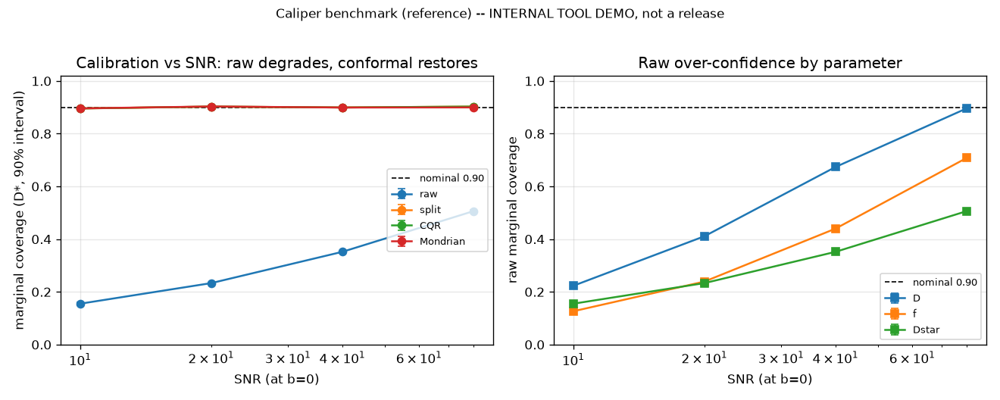
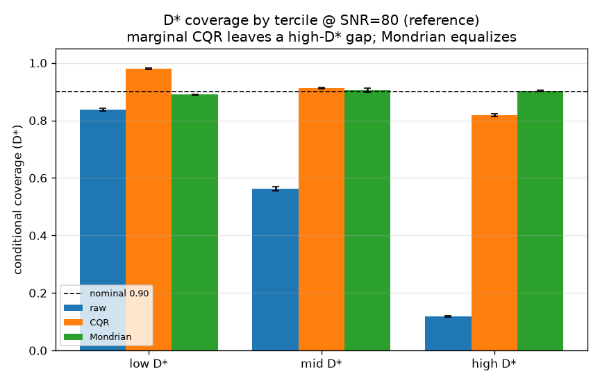
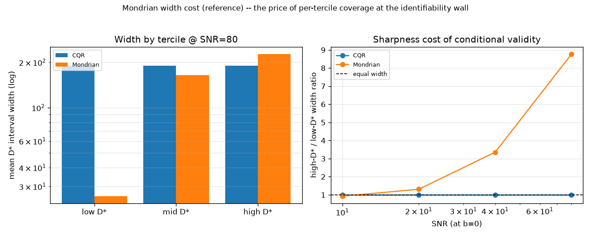

# Caliper

[](https://github.com/akarlin3/ResearchProj/actions/workflows/caliper-ci.yml)
[](LICENSE)
[](pyproject.toml)

**An IVIM uncertainty-quantification calibration toolkit.**

Caliper is a small, reviewer-oriented Python package for *measuring and
correcting* the calibration of uncertainty estimates in intravoxel incoherent
motion (IVIM) diffusion MRI. It ships four composable pieces:

1. **`caliper.metrics`** — a **model-agnostic calibration ruler** (numpy-only):
   coverage, quantile ECE, sharpness, pinball/interval score, and
   group-conditional coverage. It knows nothing about IVIM or any particular
   estimator — feed it true values and predicted quantiles.
2. **estimators under one contract** — **`caliper.estimator_maf`**, a conditional
   **masked-autoregressive-flow** posterior over `(D, f, D*)` (optional torch
   extra), and **`caliper.estimator_reference`**, a torch-free over-confident
   segmented-fit stand-in. Both expose `predict_quantiles(signals, q_levels)`,
   so the whole calibration story runs on numpy alone.
3. **`caliper.conformal`** — **split-conformal**, **CQR**, and **Mondrian
   (group-conditional) CQR** wrappers that coverage-correct *any* estimator
   exposing `predict_quantiles`, plus `conditional_coverage_by_strata` for
   reading coverage *and width* per stratum.
4. **`caliper.benchmark`** — a reproducible **evaluation harness** that sweeps
   estimators × calibration methods × SNR × seeds and scores every cell with the
   ruler. *This is internal tool infrastructure / a reproducible demo — not a
   citable benchmark or dataset release.*

All data is **synthetic and PHI-free**, generated in-repo with fixed seeds
(`caliper.forward`). There are no clinical-data dependencies.

> **Every number in this README is produced by a fixed-seed script in this
> repo**, named at each section. The torch-free numbers
> (`examples/conformal_demo.py`, `python -m caliper.benchmark`) reproduce on the
> numpy-only core; the MAF numbers (`examples/demo.py`) require the `[estimator]`
> extra.

> **Scope.** This is the *un-gated* calibration tooling, released for public use
> but **not** as a citable software release. Value-of-information scoring, the
> deployment validity monitor, and a citable JOSS/DOI release are deferred and
> gated on a separate publication — see [ROADMAP.md](ROADMAP.md).

---

## Install

```bash
pip install -e .                 # numpy-only core: ruler + forward + conformal + reference
pip install -e ".[estimator]"    # + the MAF posterior (pulls in torch)
pip install -e ".[dev]"          # + pytest, ruff
```

Python 3.10–3.12. The core (`metrics`, `forward`, `conformal`, `benchmark`,
`estimator_reference`) is numpy-only; torch is required only for `estimator_maf`.

---

## Quickstart

```bash
python examples/ruler_demo.py        # the model-agnostic ruler           [numpy]
python examples/conformal_demo.py    # raw → CQR → Mondrian, D* result    [numpy]
python -m caliper.benchmark          # the eval grid → results/benchmark.csv [numpy]
python examples/benchmark_report.py  # regenerate figures from the CSV    [numpy]
python examples/demo.py              # MAF → split-conformal under SNR shift [torch]
```

### The model-agnostic ruler API

```python
import numpy as np
from caliper import metrics as M

# y_true:   (n, n_params)
# q_pred:   (n, n_params, n_levels)   <- from any estimator's predict_quantiles
# q_levels: (n_levels,)               ascending in (0, 1)
scores = M.score_quantiles(y_true, q_pred, q_levels, alpha=0.10,
                           param_names=["D", "f", "Dstar"],
                           conditioning=y_true)      # tercile-conditional probe
print(M.format_scorecard(scores))
# each ParamScore exposes: coverage, coverage_gap, ece, sharpness,
# mean_pinball, mean_interval_score, conditional (per-tercile coverage)
```

### Conformal wrapper over any estimator

```python
from caliper.conformal import SplitConformalQuantile

cq = SplitConformalQuantile(q_levels).calibrate(q_cal, y_cal)
q_corrected = cq.apply(q_test)   # coverage-corrected quantiles, same shape
```

---

## The conformal result (torch-free — `examples/conformal_demo.py`)

The calibration story runs **without torch**, using the over-confident
segmented-fit `ReferenceIVIMEstimator`. Nominal central coverage **0.900** (90%
intervals, α = 0.10); cohorts at SNR 40 (cal n=4000 seed=1, test n=9000 seed=2).

### CQR restores **marginal** coverage

| param | raw coverage | CQR coverage | raw \|gap\| | CQR \|gap\| |
|-------|-------------:|-------------:|------------:|------------:|
| D     | 0.676 | 0.902 | 0.224 | **0.002** |
| f     | 0.435 | 0.901 | 0.465 | **0.001** |
| D\*   | 0.359 | 0.903 | 0.541 | **0.003** |

The raw reference estimator is over-confident on every parameter (reported
quantiles too narrow); CQR restores marginal coverage to within **≤0.003** of
nominal. (`SplitConformalResidual` does the same from the point estimate alone;
for this homoscedastic estimator the two coincide.)

### …but **conditional** coverage is not — the D\* tercile result

Coverage **and mean interval width** of the 90% `D*` interval, stratified by
true-D\* tercile:

| method | low-D\* cov | width | mid-D\* cov | width | high-D\* cov | width |
|--------|------:|------:|------:|------:|------:|------:|
| raw          | 0.655 | 19.7 | 0.359 | 19.7 | 0.062 | 19.7 |
| marginal CQR | 0.951 | 215  | 0.875 | 215  | 0.882 | 215  |
| Mondrian CQR | 0.893 | 58.7 | 0.909 | 261  | 0.902 | 227  |

- **Marginal CQR** restores *pooled* D\* coverage (0.903) but applies one global
  width everywhere, so the well-identified **low-D\* tercile over-covers
  (0.951)** while the poorly-identified **high-D\* tercile under-covers (0.882)**.
- **Mondrian CQR** restores per-tercile coverage (0.893 / 0.909 / 0.902) **only
  by inflating width**: high-D\* intervals are **3.87×** the low-D\* width.

Conformal guarantees marginal coverage unconditionally; conditional coverage
costs sharpness, and at high `D*` — the identifiability wall — the trade is
steep. The gap is the finding, reported as-is, not tuned away.

---

## Benchmark summary (`python -m caliper.benchmark`)

The harness sweeps `{reference} × {raw, split, CQR, Mondrian} × {SNR 10/20/40/80}
× {3 seeds}`, scores each cell with the ruler, and writes a tidy long-form table
to `results/benchmark.csv` (576 rows; fixed seeds reproduce it exactly). Figures
below regenerate **solely from that CSV** via `examples/benchmark_report.py`.
*Internal tool demo, not a benchmark release.*

**Marginal D\* coverage degrades as SNR drops; conformal restores it** (nominal
0.900, seed-averaged):

| calibration | SNR 10 | SNR 20 | SNR 40 | SNR 80 |
|-------------|-------:|-------:|-------:|-------:|
| raw         | 0.155  | 0.233  | 0.352  | 0.506  |
| split       | 0.896  | 0.903  | 0.899  | 0.903  |
| CQR         | 0.896  | 0.903  | 0.899  | 0.903  |
| Mondrian    | 0.896  | 0.903  | 0.899  | 0.900  |



**The high-D\* conditional gap is an identifiability effect — widest at high SNR,
washed out by noise at low SNR.** D\* coverage by true-D\* tercile (low/mid/high):

| calibration | @ SNR 10 | @ SNR 80 |
|-------------|----------|----------|
| raw         | 0.308 / 0.130 / 0.027 | 0.837 / 0.563 / 0.119 |
| CQR         | 0.895 / 0.874 / 0.917 | 0.980 / 0.912 / **0.817** |
| Mondrian    | 0.894 / 0.901 / 0.894 | 0.890 / 0.905 / 0.904 |

At SNR 80, marginal CQR leaves a **0.16 coverage gap** between the low- and
high-D\* terciles that it cannot close; Mondrian equalizes them.



**Mondrian's per-tercile validity costs sharpness.** High-D\* / low-D\* mean
interval-width ratio:

| calibration | SNR 10 | SNR 20 | SNR 40 | SNR 80 |
|-------------|-------:|-------:|-------:|-------:|
| CQR         | 1.00×  | 1.00×  | 1.00×  | 1.00×  |
| Mondrian    | 0.93×  | 1.31×  | 3.35×  | **8.77×** |

CQR holds one width across terciles; Mondrian must inflate the high-D\* interval
up to **8.8×** the low-D\* width to equalize coverage — the steeper the SNR, the
steeper the price.



---

## The MAF posterior (`examples/demo.py` — requires `[estimator]`: torch)

The same calibration story runs with the conditional MAF posterior in place of
the reference estimator, under a realistic **deployment shift** (flow trained at
SNR 60, evaluated at SNR 25). Numbers below are produced by `examples/demo.py`
(re-run with the `[estimator]` extra to reproduce); nominal coverage 0.900.

| param | raw coverage | conformal coverage | raw \|gap\| | conformal \|gap\| |
|-------|-------------:|-------------------:|------------:|------------------:|
| D     | 0.526 | 0.891 | 0.374 | **0.009** |
| f     | 0.550 | 0.876 | 0.350 | **0.024** |
| D\*   | 0.554 | 0.904 | 0.346 | **0.004** |

Raw MAF posterior intervals are far too tight (~53–55% empirical coverage against
a 90% target — the known model-based-UQ failure); split-conformal restores
marginal coverage to within ≤0.024 of nominal. As with the reference estimator,
the high-D\* tercile remains under-covered post-conformal (D\* g2 = 0.812 vs
0.900 nominal — the identifiability limit, not a wrapper bug).

*(MAF training is stochastic; exact values vary slightly across torch builds.)*

---

## Reproductions & citations (optional, publication-gated — **OFF by default**)

Caliper ships *synthetic, qualitative* reproductions of two associated IVIM
manuscripts. **Both are pre-publication** — there is no publication DOI for either —
so this feature is **dormant by default**: `caliper.publication.publication_enabled()`
returns `False`, and nothing in the repo presents either paper as published or
accepted. The reproductions run on in-repo synthetic phantoms only; they are **not**
published or independently validated results, and the manuscripts' clinical numbers
stay in the papers.

| Paper | Status (true) | Synthetic reproduction | Reproduces |
|---|---|---|---|
| **Gauge** — *Distribution-Free Conformal Coverage for IVIM Parameter Maps…* | **in review** at MRM (2026) | `python examples/gauge_repro.py` ([map](docs/gauge_reproduction.md)) | marginal CQR restores pooled D\* coverage; the high-D\* tercile stays under-covered (the identifiability wall); Mondrian buys it back only by inflating width |
| **Fashion** — *Calibration and Efficiency of Uncertainty Estimates in IVIM…* | **in review** at MRM (2026) | `python examples/fashion_repro.py` ([map](docs/fashion_reproduction.md)) | NLLS rails the weakly-identified D\* and under-covers; a normalizing-flow posterior is better-calibrated, scored by the ruler |

See [docs/citing.md](docs/citing.md) and [`CITATION.cff`](CITATION.cff) for how to
cite the software and the (pre-publication) manuscripts — both render as
`@unpublished` while a real DOI is absent.

**How the feature activates.** It is deliberately manual and per-paper: when a
paper publishes, fill its real `paper_doi` in `caliper.publication.PUBLICATION`
(replacing `None`). That single edit flips `PaperRef.published` and
`publication_enabled()` to `True`, turns the bibtex into `@article` with the DOI,
and re-renders the reproduction's provenance as *"validated against the published
result."* Until then it stays OFF and honest by construction. (The Zenodo DOIs in
the config are **software** code-archive DOIs, not publication DOIs, and never flip
the gate.)

---

## What's in the box

```
caliper/
  metrics.py             # numpy-only calibration ruler (the canonical core)
  forward.py             # bi-exponential IVIM model + synthetic cohorts
  conformal.py           # split-conformal / CQR / Mondrian + strata diagnostics
  estimator_reference.py # over-confident segmented-fit IVIM estimator  [numpy]
  estimator_maf.py       # conditional MAF posterior over (D, f, D*)    [torch]
  benchmark.py           # reproducible evaluation harness (tool demo)  [numpy]
  baselines.py           # box-constrained NLLS IVIM baseline           [scipy]
  repro_gauge.py         # Gauge reproduction (conformal D* wall)       [numpy]
  publication.py         # publication-gated citation layer (OFF)       [numpy]
examples/
  ruler_demo.py          # the model-agnostic ruler                     [numpy]
  conformal_demo.py      # conformal + D* tercile result                [numpy]
  benchmark_report.py    # regenerate figures from results/benchmark.csv [numpy]
  demo.py                # MAF end-to-end pipeline                       [torch]
  gauge_repro.py         # Gauge synthetic reproduction                 [numpy]
  fashion_repro.py       # Fashion synthetic reproduction         [torch+scipy]
  figures/               # PNGs regenerated from the benchmark CSV
docs/                    # index, API ref, reproduction maps, citing (Markdown)
CITATION.cff             # software + pre-publication manuscript citations
results/benchmark.csv    # the benchmark table (every number traces to a run)
tests/                   # pytest: metrics, forward, conformal, reference, benchmark,
                         #         baselines, repro_gauge, publication
                         #         + estimator_maf (auto-skips without torch)
```

Run the tests:

```bash
pip install -e ".[dev]"
pytest -q          # 77 passed, 1 skipped (the MAF test group needs torch)
# with the [estimator] extra installed: 81 passed (MAF tests included)
```

## License

MIT — see [LICENSE](LICENSE).

## Roadmap

See [ROADMAP.md](ROADMAP.md). Value-of-information, decision-gap, and deployment
validity-monitor functionality — and any citable JOSS/DOI release — are
**deliberately deferred** and not implemented here.
