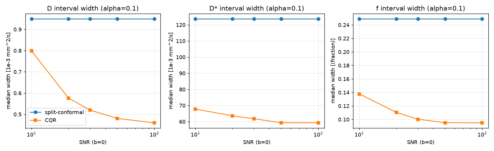

# Gauge

**Distribution-free conformal coverage for IVIM parameter maps.**

Gauge brings finite-sample, distribution-free **conformal** prediction intervals to
intravoxel-incoherent-motion (IVIM) parameter estimation (D, D*, f), and is built to
be benchmarked against model-based calibration. This repository is **Gauge 01 — the
foundation**: it confirms the positioning still holds (no prior-art collision) and
that conformal coverage actually works on synthetic IVIM. It deliberately **stops
before** the model-based benchmark (that is Gauge 02).

See [`POSITIONING.md`](POSITIONING.md) for the full prior-art sweep and contribution
statement, and [`results/coverage_report.txt`](results/coverage_report.txt) for the
verbatim coverage printout.

---

## Headline result (both halt-able gates passed)

- **GATE 0 (positioning + feasibility): PASS.** No paper provides conformal /
  distribution-free coverage for IVIM *and* a model-based benchmark (ISMRM 2024
  #2228 is relaxometry/B0 with no benchmark; Casali 2026 is model-based, not
  conformal). And clean-signal recovery returns truth to ~1e-7 relative error.
- **GATE 1 (conformal correctness): PASS.** Realized coverage tracks nominal within
  **0.03 for all 24 cells** (2 methods × 3 parameters × 4 α) on the held-out test
  split.

### CP1 coverage table (realized vs nominal, n_test = 3000; printed in-session)

`med width`: D, D* in 10⁻³ mm²/s; f is a fraction.

**split-conformal (base = NLLS)**

| param | α | nominal | realized | \|diff\| | med width | gate |
|------:|:--:|:------:|:--------:|:-------:|:---------:|:----:|
| D  | 0.05 | 0.95 | 0.951 | 0.001 | 1.615   | OK |
| D  | 0.10 | 0.90 | 0.899 | 0.001 | 0.949   | OK |
| D  | 0.20 | 0.80 | 0.804 | 0.004 | 0.514   | OK |
| D  | 0.30 | 0.70 | 0.699 | 0.001 | 0.326   | OK |
| D* | 0.05 | 0.95 | 0.948 | 0.002 | 216.715 | OK |
| D* | 0.10 | 0.90 | 0.897 | 0.003 | 123.668 | OK |
| D* | 0.20 | 0.80 | 0.800 | 0.000 | 70.681  | OK |
| D* | 0.30 | 0.70 | 0.703 | 0.003 | 46.881  | OK |
| f  | 0.05 | 0.95 | 0.954 | 0.004 | 0.444   | OK |
| f  | 0.10 | 0.90 | 0.907 | 0.007 | 0.249   | OK |
| f  | 0.20 | 0.80 | 0.806 | 0.006 | 0.134   | OK |
| f  | 0.30 | 0.70 | 0.695 | 0.005 | 0.084   | OK |

**CQR (base = gradient-boosted quantile regression)**

| param | α | nominal | realized | \|diff\| | med width | gate |
|------:|:--:|:------:|:--------:|:-------:|:---------:|:----:|
| D  | 0.05 | 0.95 | 0.946 | 0.004 | 0.741  | OK |
| D  | 0.10 | 0.90 | 0.901 | 0.001 | 0.534  | OK |
| D  | 0.20 | 0.80 | 0.815 | 0.015 | 0.373  | OK |
| D  | 0.30 | 0.70 | 0.712 | 0.012 | 0.275  | OK |
| D* | 0.05 | 0.95 | 0.950 | 0.000 | 73.737 | OK |
| D* | 0.10 | 0.90 | 0.902 | 0.002 | 63.093 | OK |
| D* | 0.20 | 0.80 | 0.793 | 0.007 | 47.916 | OK |
| D* | 0.30 | 0.70 | 0.689 | 0.011 | 36.554 | OK |
| f  | 0.05 | 0.95 | 0.942 | 0.008 | 0.145  | OK |
| f  | 0.10 | 0.90 | 0.893 | 0.007 | 0.106  | OK |
| f  | 0.20 | 0.80 | 0.797 | 0.003 | 0.072  | OK |
| f  | 0.30 | 0.70 | 0.703 | 0.003 | 0.054  | OK |

### Sharpness & the ill-posed compartment (α = 0.10)



Derived from the table/printout above:

- **D\* is essentially unidentifiable per-voxel.** Its 90% interval (split: 123.7,
  CQR: 63.1 ×10⁻³ mm²/s) is comparable to or **wider than the entire D\*
  physiological range** (span 90 ×10⁻³). Identifiability ranking **D > f > D\***
  matches the IVIM literature and Casali's documented D\* overconfidence — and is
  the regime Gauge 02's benchmark targets.
- **CQR is ~1.8–2.4× sharper than split-conformal** at equal coverage (D 1.78×,
  D\* 1.96×, f 2.35× at α=0.10), because it adapts interval width to the input.
- **Marginal vs conditional coverage.** Split-conformal uses one global radius per
  parameter (flat lines in the figure), so it **under-covers low SNR and
  over-covers high SNR** (e.g. D conditional coverage 0.65 at SNR 10 → 1.00 at SNR
  100). CQR's SNR-adaptive width keeps conditional coverage much flatter (D:
  0.81 → 0.97). Conformal guarantees *marginal* coverage only; the per-SNR spread
  is expected and motivates Mondrian/group-conditional CP as future work.

---

## Repository layout

```
gauge/
  forward.py      bi-exponential IVIM forward model + Rician noise
  cohort.py       labeled synthetic cohort with train/cal/test splits
  estimators.py   NLLS base estimator + gradient-boosted quantile regressor
  conformal.py    split-conformal + CQR + coverage/width helpers
scripts/
  sanity_forward.py   CP0 GATE 0 forward-model sanity (clean recovery -> truth)
  run_coverage.py     CP1 GATE 1 coverage validation + sharpness vs SNR
tests/            property/correctness tests (forward, estimators, conformal, cohort)
results/          coverage_report.txt + sharpness_vs_snr.png (generated)
POSITIONING.md    CP0 deliverable: prior art, contribution, GATE 0
```

## Reproduce

```bash
python -m venv .venv && . .venv/bin/activate
pip install -r requirements.txt

python scripts/sanity_forward.py   # CP0 / GATE 0 forward-model sanity
python scripts/run_coverage.py     # CP1 / GATE 1 coverage + sharpness
python -m pytest -q                # 36 property/correctness tests
```

Everything is seeded (cohort seed 20260613); reruns reproduce the tables above.

## Gauge 02 — the benchmark (conformal vs model-based UQ)

Gauge 02 runs the head-to-head on this same cohort. Full write-up with all tables
and figures: [`gauge/results.md`](gauge/results.md). Honest headline:

- **The marginal D\*/f hypothesis is NOT supported.** Model-based UQ (probabilistic
  NN, MDN deep-ensemble à la Casali, deep-ensemble, Bayesian MCMC) is overconfident
  **broadly** across D, D\*, f — for the NN ensembles D\* is even among the
  better-covered marginally.
- **Conformal supplies the guarantee they lack**, and **conformalizing the MDN is
  the sharpest valid recipe** (0.65–0.79× pure-CQR width at equal coverage).
- **The unstable compartment bites _conditionally_:** the high-D\* regime
  under-covers across every method and every SNR (invisible marginally), and
  **SNR-Mondrian cannot fix it** because the failure axis is the unknown true D\* —
  the refined, IVIM-specific form of the original hypothesis, and a genuine open
  problem.

Modules: [`gauge/baselines.py`](gauge/baselines.py) (model-based UQ; CP0),
[`gauge/benchmark.py`](gauge/benchmark.py) (CP1), [`gauge/conditional.py`](gauge/conditional.py)
(CP2), figures in [`gauge/figures/`](gauge/figures/). Fashion is **related work
only**, never a baseline.

```bash
python -m gauge.baselines      # CP0 / GATE 0  (builds + caches predictions)
python -m gauge.benchmark      # CP1 / GATE 1  (head-to-head)
python -m gauge.conditional    # CP2 / GATE 2  (conditional coverage)
python scripts/make_figures.py # CP3 figures (vector PDF)
```
