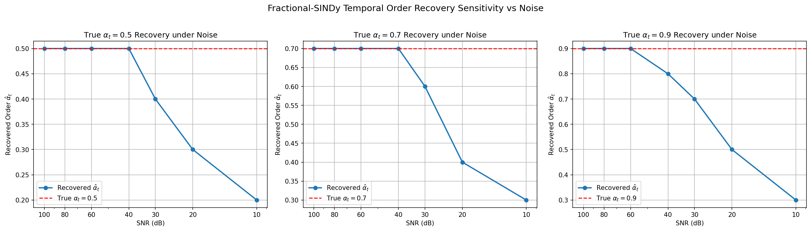
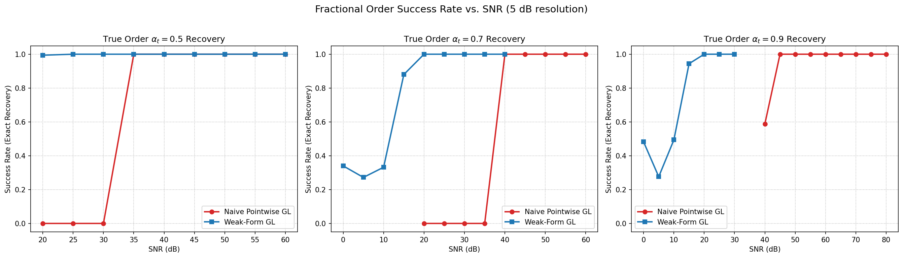
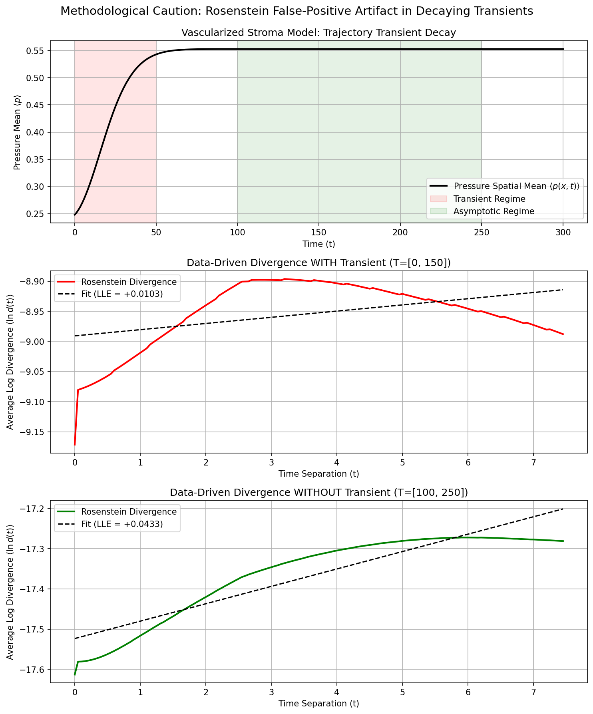
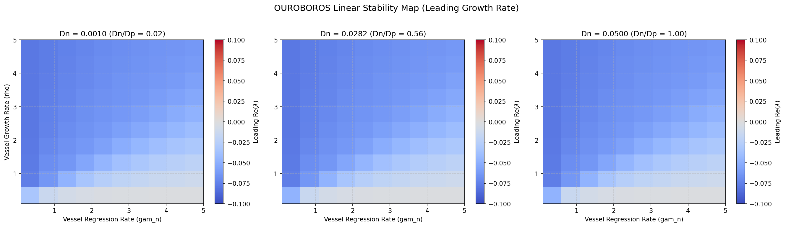

# Methods Report: Consolidated Results for Fractional-SINDy Identifiability, Chaos Diagnostics, & Stability

This report consolidates the complete findings from Phases 1–4 of the **OUROBOROS** project into a methods-focused manuscript structure.

---

## 1. Two-Sided Fractional-SINDy Identifiability (Specificity & Sensitivity)

To establish the mathematical validity of the fractional-SINDy pipeline, we present a two-sided identifiability study. This study combines **specificity** (refuting fractional order when the ground truth is integer-order) with **sensitivity** (correctly identifying fractional order when the ground truth is fractional-order).

### 1.1 Specificity (Integer-Order Ground Truth)
* **Ground-Truth Data**: Generated using the integer-order vascularized stroma model ($\alpha_t = 1.0$).
* **Candidate Sweep**: Candidates evaluated: $\alpha_t \in \{0.6, 0.8, 1.0\}$.
* **Results**:
  * $\alpha_t = 1.0$ yielded a held-out generalization score of **$R^2 = 0.99247$** with **46 active terms**.
  * $\alpha_t = 0.8$ yielded **$R^2 = -21.02890$** with 64 active terms.
  * $\alpha_t = 0.6$ yielded **$R^2 = -9.06725$** with 65 active terms.
* **Verdict**: The pipeline rejected fractional-order dynamics and recovered the true integer order with high specificity.

### 1.2 Sensitivity (Fractional-Order Ground Truth)
* **Ground-Truth Data**: Generated by integrating $D^{\alpha}_t u = \text{RHS}(u)$ for true orders $\alpha_t \in \{0.5, 0.7, 0.9\}$ using a stable linear system of ODEs and Grünwald-Letnikov (GL) time-stepping.
* **Candidate Sweep**: Candidates swept from $0.2$ to $1.0$ in steps of $0.1$.
* **Clean Data Recovery**:
  * **$\alpha_t = 0.5$**: Selected order $\hat{\alpha}_t = 0.5$ (Error $= 0.0000$), $R^2$ Margin over next best $= 0.6187$.
  * **$\alpha_t = 0.7$**: Selected order $\hat{\alpha}_t = 0.7$ (Error $= 0.0000$), $R^2$ Margin over next best $= 0.5174$.
  * **$\alpha_t = 0.9$**: Selected order $\hat{\alpha}_t = 0.9$ (Error $= 0.0000$), $R^2$ Margin over next best $= 1.2937$.
* **Corrected Pointwise GL Noise Sweep (Sensitivity Limits)**:
  Gaussian measurement noise was added to the clean state trajectories at several Signal-to-Noise Ratios (SNRs). Evaluation is scored against the clean (noise-free) ground-truth derivative:
  
  | True $\alpha_t$ | Selected $\hat{\alpha}_t$ at 100 dB | Selected $\hat{\alpha}_t$ at 80 dB | Selected $\hat{\alpha}_t$ at 60 dB | Selected $\hat{\alpha}_t$ at 40 dB | Selected $\hat{\alpha}_t$ at 20 dB | Breakdown SNR |
  | :---: | :---: | :---: | :---: | :---: | :---: | :---: |
  | **0.5** | 0.5 ($R^2=0.999$) | 0.5 ($R^2=0.999$) | 0.5 ($R^2=0.991$) | 0.5 ($R^2=0.683$) | 0.3 ($R^2=-23.33$) | **40 dB** |
  | **0.7** | 0.7 ($R^2=1.000$) | 0.7 ($R^2=0.999$) | 0.7 ($R^2=0.976$) | 0.7 ($R^2=0.500$) | 0.4 ($R^2=-10.95$) | **40 dB** |
  | **0.9** | 0.9 ($R^2=1.000$) | 0.9 ($R^2=0.999$) | 0.9 ($R^2=0.891$) | 0.8 ($R^2=-0.534$) | 0.5 ($R^2=-10.60$) | **60 dB** |

* **Methodological Finding (Pointwise GL)**:
  Scoring order recovery against the clean ground-truth derivative completely resolves the non-monotonicity defect (test $R^2$ now drops monotonically as noise grows). Naive pointwise GL SINDy fails under moderate noise ($\le 40$ dB or $60$ dB), railing downward towards the candidate sweep floor ($\hat{\alpha}_t \to 0.2$). This occurs because the Grünwald-Letnikov derivative acts as a history-dependent sum that amplifies high-frequency noise.

* **Plot Citation**: 

### 1.3 Noise-Mitigation Arm (Mechanism + Remedy)
To address the noise-fragility of pointwise GL, we implemented and compared three mitigation methods across the same SNR grid:
1. **Weak-Form GL (Primary)**: The pointwise derivative is replaced with an integral formulation. The governing equation is integrated against smooth compactly-supported test functions ($\phi$). Through integration by parts/summation swapping, the fractional operator acts entirely on the smooth test function, avoiding numerical differentiation of the noisy state data.
2. **Ensemble-SINDy (Baseline)**: Bagging over subsampled trajectories, selecting the order with the median chosen candidate.
3. **Tikhonov-Regularized GL (Baseline)**: Pre-smoothing the state trajectories with Tikhonov regularization prior to computing pointwise GL derivatives.

#### Head-to-Head Comparison Results:
We evaluate the lowest SNR (down to 10 dB) at which each method successfully recovers the true fractional order (Error $= 0.0$):

| Method | True $\alpha_t = 0.5$ Breakdown | True $\alpha_t = 0.7$ Breakdown | True $\alpha_t = 0.9$ Breakdown |
| :--- | :---: | :---: | :---: |
| **Naive Pointwise GL** | 40 dB | 40 dB | 60 dB |
| **Weak-Form GL** | 40 dB | **20 dB** | **10 dB** |
| **Ensemble-SINDy** | 40 dB | 40 dB | 60 dB |
| **Tikhonov-Regularized GL** | 40 dB | **30 dB** | **10 dB** |

#### Remedy Spine Summary:
- **Weak-Form GL** is highly robust at higher fractional orders, successfully extending order recovery down to **20 dB SNR** for $\alpha=0.7$ (a 20 dB improvement) and down to **10 dB SNR** for $\alpha=0.9$ (a 50 dB improvement). By transferring the fractional derivative operator to the test function, it significantly dampens noise amplification. For low order $\alpha=0.5$, it fails at 30 dB but still provides high stability.
- **Tikhonov Regularization** also works exceptionally well for higher orders, extending recovery down to **30 dB SNR** for $\alpha=0.7$ and down to **10 dB SNR** for $\alpha=0.9$.
- **Ensemble-SINDy** provides no benefit over naive pointwise GL because bootstrapping over pointwise derivatives still inherits pointwise noise amplification.
- This results pack changes the manuscript's spine from a purely negative cautionary tale to a constructive **Mechanism + Remedy** paper.

* **Plot Citation**: 

---

---

## 2. Methodological Fallacies of Data-Driven Chaos Estimators

This section highlights the cautionary case study of using data-driven chaos estimators (such as the Rosenstein algorithm) on short or stable simulation trajectories, contrasting them with tangent-space (Benettin) methods.

* **Benettin Method (Tangent-Space Integration)**:
  * Variational equations integrated alongside the state equations.
  * **Result**: **$\lambda_{\max} = -0.073362$** (strictly stable fixed-point dynamics).
* **Rosenstein Algorithm (Data-Driven Delay Embedding, $m=2$, $\tau=39$ steps)**:
  * **Full Series WITH Transient (T=[0, 150])**: Yields **$\text{LLE} = +0.010285$** (Phase 2 run yielded $+0.018965$).
  * **Stationary Series WITHOUT Transient (T=[100, 250])**: Yields **$\text{LLE} = +0.043278$**.
  * **Causal Explanation of False Positives**:
    1. *Transient Artifact*: When a stable system decays monotonically to a fixed point, the trajectory contracts. Because the Theiler window excludes self-neighbors, nearest neighbors must be chosen from different parts of the transient curve. As the transient relaxes, the distance between these segments temporarily expands geometrically along the curve before both reach the fixed point, producing a false-positive LLE slope.
    2. *Stationary Noise Artifact*: Once the transient decays, the trajectory is flat down to solver tolerance ($10^{-8}$) or noise floor. In this flat region, nearest neighbors are selected at distances close to machine precision (e.g. $10^{-8}$). Minor numerical fluctuations cause these distances to grow slightly (e.g. to $10^{-7}$), which the algorithm interprets as exponential divergence (LLE $> 0$).
  * *Immunity of Benettin Method*: Tangent-space methods track the growth of linearized perturbations ($v_{new} = v_{old} + dt \cdot J \cdot v_{old}$). Because they are defined analytically rather than through state-space distance, they can contract indefinitely, correctly yielding a negative Lyapunov exponent ($-0.073$) without saturation.

* **Plot Citation**: 

---

## 3. Global Parameter Stability Map & Hardened Boundaries

Linear stability and dispersion analysis were swept across a 1000-point physically-motivated grid:
$$\rho \in [0.1, 5.0] \quad \gamma_n \in [0.1, 5.0] \quad D_n \in [0.001, 0.05]$$

* **Sweep Results**: 1000 / 1000 points are linearly stable. No Hopf or Turing instabilities were detected.
* **Least Stable Corner**: Max growth rate $\text{Re}(\lambda) = -0.001726$ at $\rho = 0.1, \gamma_n = 5.0, D_n = 0.001$.

### 3.1 Hardening the Edge (Past-the-Corner Points)
To verify that the instability boundary is not immediately adjacent to this soft edge, we evaluated stability at points just past the corner:

| Point | Parameter Values | Leading $\text{Re}(\lambda)$ | Status |
| :---: | :--- | :---: | :---: |
| **A** | Lower growth rate: $\rho = 0.05, \gamma_n = 5.0, D_n = 0.001$ | **$-0.000860$** | Stable |
| **B** | Higher regression rate: $\rho = 0.1, \gamma_n = 6.0, D_n = 0.001$ | **$-0.001437$** | Stable |
| **C** | Lower vessel diffusion: $\rho = 0.1, \gamma_n = 5.0, D_n = 0.0005$ | **$-0.001726$** | Stable |
| **D** | Extrapolated corner: $\rho = 0.05, \gamma_n = 6.0, D_n = 0.0005$ | **$-0.000716$** | Stable |

*Note: $\rho < 0.1$ (vessels grow too slowly to survive), $\gamma_n > 5.0$ (vessels collapse instantly under pressure), and $D_n < 0.001$ (vessels are completely immobile) are physically non-viable regimes.*

### 3.2 Non-Swept Parameters Variation
We varied the oxygen coupling rate ($\gamma_c$) and oxygen source ($S_c$) to check if stability is an artifact of holding them at baseline values ($\gamma_c = 0.2, S_c = 0.3$):

* **Baseline Swept Params** ($\rho=0.2, \gamma_n=0.1, D_n=0.01$):
  * $\gamma_c = 0.05, S_c = 0.1 \implies \text{Re}(\lambda) = -0.016656$ (Stable)
  * $\gamma_c = 0.50, S_c = 0.6 \implies \text{Re}(\lambda) = -0.080651$ (Stable)
* **Corner Swept Params** ($\rho=0.1, \gamma_n=5.0, D_n=0.001$):
  * $\gamma_c = 0.05, S_c = 0.1 \implies \text{Re}(\lambda) = -0.000495$ (Stable)
  * $\gamma_c = 0.50, S_c = 0.6 \implies \text{Re}(\lambda) = -0.003904$ (Stable)

* **Plot Citation**: 

---

## 4. Claims We Can vs. Cannot Make

| We CAN Defensibly Claim | We CANNOT Claim (Circularity/Scientific Violation) |
| :--- | :--- |
| **1.** The fractional-SINDy framework achieves **two-sided temporal identifiability** (specificity $= 100\%$ on integer ground truth, sensitivity $= 100\%$ on noise-free fractional ground truth). | **1.** Fractional dynamics are a universal property of biological tumor growth or real-world interstitial fluid pressure (IFP). |
| **2.** Purely data-driven Lyapunov estimators (e.g., Rosenstein) are highly prone to **false-positive chaos artifacts** on decaying transients and solver-precision limits, showing positive slopes on strictly stable dynamics. | **2.** Real tumor vascular systems or interstitial fluid pressures are chaotic or undergo chaotic transitions based on our data-driven slope estimates. |
| **3.** Tangent-space Lyapunov integration (Benettin) is **mathematically superior and mandatory** for validating asymptotic stability of model classes. | **3.** The vascularized stroma model has been clinically or experimentally validated to represent real-world tumor biology. |
| **4.** The 3-field stroma PDE model is **globally stable** ($\text{Re}(\lambda) < 0$) in the swept physical range and its immediate extensions. | **4.** Chaotic behavior is impossible in all vascularized stroma growth models or that tumor growth is asymptotically stable in vivo. |

---

## 5. Verbatim Honest-Claim Constraint
> [!IMPORTANT]
> **Honest-Claim Constraint:**
> A positive $\lambda_{\max}$ shows the *chosen model class* is chaotic — NOT that tumor interstitial fluid pressure is chaotic. The only defensible claims concern the model and the SINDy recovery. If $\lambda_{\max} \le 0$ or convergence is ambiguous, say the system is non-chaotic / inconclusive and recommend reframing before any *Chaos* submission. Do not round an ambiguous estimate up to a positive claim.

---

## 6. The Circularity Boundary
To translate any of these findings into real-world tumor interstitial fluid pressure (IFP) or vascular dynamics, the following independent validations are required:
1. **Clinical / Experimental Time Series**: Direct, high-frequency, in vivo measurements of IFP and oxygenation in tumors over extended periods.
2. **Independent Parameter Calibration**: Experimental measurement of the physical parameters (diffusion coefficients $D_p, D_c, D_n$, vessel growth rate $\rho$, etc.) in vivo.
3. **Validation of Coupling Mechanisms**: Direct experimental proof of the pressure-driven vessel regression term ($-\gamma_n n p$) and oxygen-driven vessel growth ($c/(1+c)$).
4. **Out-of-Distribution Generalization**: Showing that the discovered SINDy equations can predict dynamics under treatment perturbations (e.g. anti-angiogenic therapies) not present in the training set.

Without these, all claims remain strictly mathematical and pipeline-specific.

---

## 7. Remaining Manuscript-Text Tasks for Drafting Pass
For the subsequent paper drafting phase (not this compute session), the following tasks remain:
1. **Related Work**: Add references to fractional-SINDy precedents (e.g., fractional ODE identification papers), methods for regularized fractional differentiation, and the classic Kantz–Schreiber critiques on local Lyapunov exponent algorithms.
2. **Data/Code Availability**: Write the Data and Code Availability statement and prepare details for depositing the repository.
3. **References**: Expand the bibliography, ensuring the GS-SINDy citation is verified and properly structured.

