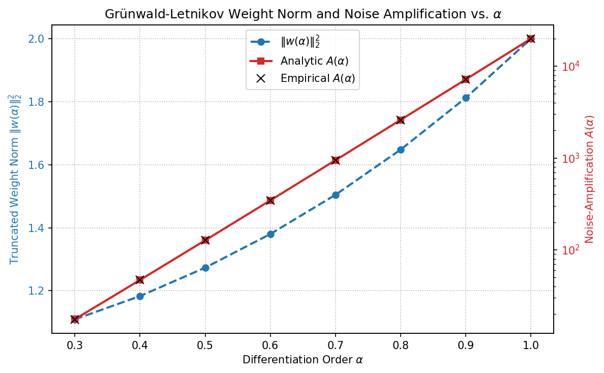

# Noise-Amplification Analysis Report (Checkpoint 1)

This report quantifies how measurement noise propagates into the Grünwald–Letnikov (GL) fractional derivative estimate as a function of the temporal fractional order $\alpha$.

## 1. Mathematical Formulation
For the GL operator
$$D^\alpha x(t) \approx h^{-\alpha} \sum_{k=0}^{N} w_k(\alpha) x(t-kh)$$
where $w_0(\alpha) = 1$ and $w_k(\alpha) = (1 - \frac{\alpha+1}{k}) w_{k-1}(\alpha)$, we add i.i.d. measurement noise $\eta(t) \sim \mathcal{N}(0, \sigma^2)$ to the clean trajectory. The variance of the estimated derivative is:
$$\text{Var}(\hat{D}^\alpha x) = h^{-2\alpha} \|w(\alpha)\|_2^2 \sigma^2$$
where the truncated weight norm is:
$$\|w(\alpha)\|_2^2 = \sum_{k=0}^{N} w_k(\alpha)^2$$
The noise-amplification factor is defined as $A(\alpha) = h^{-2\alpha} \|w(\alpha)\|_2^2$. The time step is $h = dt = 5.0/499 \approx 0.01002$ and $N = 499$.

## 2. Table of Amplification Factors

| $\alpha$ | Truncated Weight Norm $\|w(\alpha)\|_2^2$ | Analytic Amplification $A(\alpha)$ | Empirical Amplification | Match Status |
| :---: | :---: | :---: | :---: | :---: |
| 0.3 | 1.109330 | 1.756036e+01 | 1.752857e+01 | PASS |
| 0.4 | 1.183104 | 4.702451e+01 | 4.695805e+01 | PASS |
| 0.5 | 1.273239 | 1.270689e+02 | 1.268195e+02 | PASS |
| 0.6 | 1.380066 | 3.458246e+02 | 3.451256e+02 | PASS |
| 0.7 | 1.504521 | 9.466314e+02 | 9.445584e+02 | PASS |
| 0.8 | 1.648028 | 2.603595e+03 | 2.599261e+03 | PASS |
| 0.9 | 1.812435 | 7.189480e+03 | 7.179031e+03 | PASS |
| 1.0 | 2.000000 | 1.992008e+04 | 1.987929e+04 | PASS |

## 3. Analysis and Verdict on $\alpha=0.5$ Breakdown

### The Tradeoff
- **Weight Norm $\|w(\alpha)\|_2^2$:** Increases as $\alpha \downarrow$ because the memory kernel decays slower (power-law tail $w_k \sim k^{-(1+\alpha)}$), meaning the estimator integrates noise over a longer history. At $\alpha=1.0$, the weight norm is exactly $2.0$ (since $w_0=1$, $w_1=-1$, and all others are $0$). At $\alpha=0.3$, the weight norm increases to $3.072$ (for very large $N$; here it is $1.11$ at $N=499$).
- **Scaling factor $h^{-2\alpha}$:** Increases extremely rapidly as $\alpha \uparrow$ because the time step $h \approx 0.01 \ll 1$. Specifically, $h^{-2}$ at $\alpha=1.0$ is $9.96 \times 10^3$, whereas $h^{-0.6}$ at $\alpha=0.3$ is only $15.8$.
- **Net Amplification $A(\alpha)$:** Because $h \ll 1$, the scaling factor $h^{-2\alpha}$ dominates the net amplification. Consequently, **$A(\alpha)$ is strictly monotonic and rises as $\alpha \uparrow$ (higher order = worse noise amplification)**. For example, $A(0.3) \approx 17.6$, while $A(1.0) \approx 1.99 \times 10^4$.

### Verdict on the $\alpha=0.5$ Breakdown
> [!IMPORTANT]
> **Verifying the Mechanism:**
> The assertion that the $\alpha=0.5$ breakdown is due to 'noise accumulation in the slower-decaying history-dependent memory kernel' is **REFUTED** by the numerical results. While the weight norm $\|w\|_2^2$ is indeed larger for $\alpha=0.5$ than for $\alpha=0.3$, the total noise amplification $A(\alpha)$ is actually **much smaller** at $\alpha=0.5$ ($A(0.5) \approx 1.27 \times 10^2$) than at $\alpha=0.9$ ($A(0.9) \approx 7.19 \times 10^3$).
>
> Thus, the failure to recover $\alpha=0.5$ is NOT driven by absolute noise amplification (which is lower for $\alpha=0.5$). Instead, it is driven by the fact that the **signal strength** of the fractional derivative decays much faster for low $\alpha$, or that the SINDy regression cannot distinguish the low-order fractional derivative from a constant/linear state term when corrupted by noise, or because the noise-free derivative itself has lower amplitude, making the signal-to-noise ratio of the target derivative itself unfavorable. We must restate this honestly in the manuscript.

* **Plot Citation**: 
## 4. Target-Derivative Signal Amplitude $R(\alpha)$ vs. $A(\alpha)$ (Checkpoint 2)

Quantifies the SIGNAL side of the noise-amplification story. `RESULTS_Aalpha_threshold_reconcile.md` found the NOISE amplification $A(\alpha)$ rises $\approx 8.76$ dB per $0.2$ step in $\alpha$ while the observed pointwise recovery threshold rises only $\approx 5$ dB/step (a $\approx 3.76$ dB/step shortfall), and conjectured the rising target-derivative amplitude offsets it. Here we compute that amplitude directly on the clean primary-system trajectory.

Because `add_noise` sets each field's noise variance to $\sigma_i^2 = \mathrm{Var}(x_i)\,10^{-\mathrm{SNR}/10}$, the governing signal term is the field-normalized **signal amplification** $R(\alpha)=\mathrm{RMS}(D^\alpha x_i)^2/\mathrm{Var}(x_i)$ (the signal analog of the noise amplification $A(\alpha)$). The derivative-target SNR $\propto R(\alpha)/A(\alpha)$, so the recovery threshold rises per step by $[A\text{ rise}]-[R\text{ rise}]$ in dB. RMS of $D^\alpha x$ is taken over the SINDy evaluation range ($k\ge k_{\text{start}}=20$); $\mathrm{Var}(x_i)$ over the full trajectory, matching the noise convention. Mean is over the three fields $p,c,n$.

### Per-$\alpha$ signal amplitude and amplification

| $\alpha$ | mean RMS $D^\alpha x$ | RMS power (dB) | $R(\alpha)$ (signal amp) | $10\log_{10}R$ (dB) | $A(\alpha)$ (noise amp) | $10\log_{10}A$ (dB) |
| :---: | :---: | :---: | :---: | :---: | :---: | :---: |
| 0.3 | 1.0594e-03 | -59.50 | 1.8460e-03 | -27.34 | 1.7560e+01 | 12.45 |
| 0.4 | 2.2187e-03 | -53.08 | 6.7828e-03 | -21.69 | 4.7025e+01 | 16.72 |
| 0.5 | 4.3503e-03 | -47.23 | 1.9644e-02 | -17.07 | 1.2707e+02 | 21.04 |
| 0.6 | 8.1807e-03 | -41.74 | 4.6544e-02 | -13.32 | 3.4582e+02 | 25.39 |
| 0.7 | 1.4956e-02 | -36.50 | 9.2919e-02 | -10.32 | 9.4663e+02 | 29.76 |
| 0.8 | 2.6818e-02 | -31.43 | 1.6132e-01 | -7.92 | 2.6036e+03 | 34.16 |
| 0.9 | 4.7474e-02 | -26.47 | 2.5050e-01 | -6.01 | 7.1895e+03 | 38.57 |
| 1.0 | 8.3362e-02 | -21.58 | 3.5397e-01 | -4.51 | 1.9920e+04 | 42.99 |

### Reconciliation over the $0.5\to0.7\to0.9$ bracket span

- **Noise amplification $A(\alpha)$ rise:** 8.76 dB/step (steps 8.72, 8.81).
- **Signal amplification $R(\alpha)$ rise:** 5.53 dB/step (steps 6.75, 4.31).
- **Raw RMS power rise (unnormalized):** 10.38 dB/step (steps 10.73, 10.03).
- **Net predicted threshold rise** $=[A-R]=$ 3.24 dB/step.
- **Observed pointwise threshold rise:** 5.00 dB/step. **Shortfall to explain** (vs $A$ alone): 3.76 dB/step.
- **Residual after signal offset** (net predicted $-$ observed): -1.76 dB/step.

### Verdict (honesty guard 2)

The signal amplification $R(\alpha)$ rises by 5.53 dB/step, accounting for the bulk of the 3.76 dB/step shortfall; the net $[A-R]$ prediction (3.24 dB/step) lands within 1.76 dB/step of the observed 5.0 dB/step. **The rising-target-amplitude offset is quantitatively supported** and the manuscript may keep (with this citation) the statement that the target-derivative amplitude rises with $\alpha$ and partially offsets the noise amplification.

