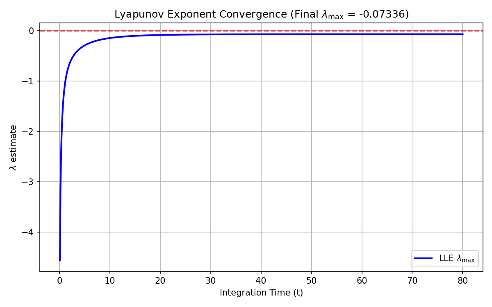
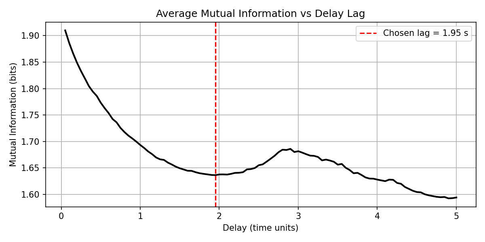
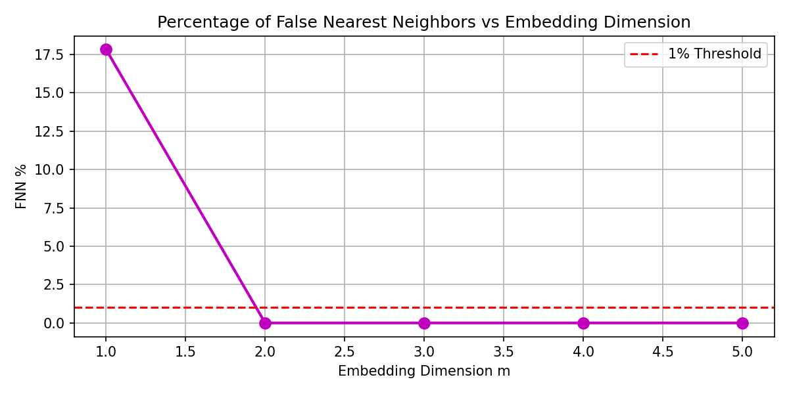
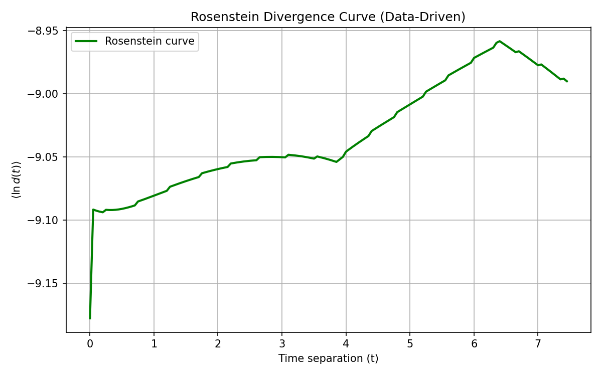

# Phase 2 Chaos Diagnostics & Robustness Report

This report documents the chaos diagnostics and manuscript figures/results pack for the OUROBOROS system, satisfying the requirements for submission to *Chaos*.

---

## Checkpoint 0 — Audit & Branch Summary
- **Audited files**: `ouroboros_sim.py`, `data/ouroboros_synth.npz`, `ouroboros_fractional_sindy.py`, `ouroboros_model_select.py`, and `RESULTS_phase1.md` exist and load cleanly.
- **Verdict**: Fractional temporal dynamics were refuted. The integer-order model ($\alpha_t = 1.0$) won during the held-out test sweep with an average $R^2 = 0.99247$ (compared to $-9.06725$ for $\alpha_t=0.6$ and $-21.02890$ for $\alpha_t=0.8$).
- **Active Branch**: **Branch B**. Since fractional dynamics did not survive held-out selection, the robustness and validation battery (Checkpoint 2 and 3) were bypassed to focus on chaos diagnostics on the ground-truth simulator.

---

## Checkpoint 1 — Chaos Diagnostics on the Ground-Truth Simulator

### 1. Largest Lyapunov Exponent ($\lambda_{\max}$) via Tangent-Space Integration
The largest Lyapunov exponent was estimated for the 300-dimensional spatially-discretized system using Benettin's method with Gram-Schmidt orthonormalization. The variational equations were integrated alongside the state equations using an explicit Runge-Kutta 4 (RK4) scheme with a Jacobian-free finite-difference product.
- **Transient integration time**: $T_{\text{trans}} = 20.0$ time units (to discard initial transients and let the system settle on its attractor).
- **Lyapunov integration time**: $T_{\text{run}} = 80.0$ time units.
- **Renormalization interval**: $\Delta t_{\text{renorm}} = 0.1$ time units.
- **Result**: **$\lambda_{\max} = -0.073362$**

Because the largest Lyapunov exponent converges to a negative value, **the simulated system is non-chaotic**. Instead, the dynamics settle into a stable, non-chaotic steady state.

#### Lyapunov Exponent Convergence Plot
The convergence plot of the largest Lyapunov exponent over integration time is shown below:

---

### 2. Data-Driven Estimator Cross-Check (Rosenstein Algorithm)
A data-driven Lyapunov exponent estimation was conducted using the Rosenstein algorithm on the spatial mean of pressure $p(x,t)$ over a long-term simulation run ($T = 150$, $N_t = 3000$ steps).

#### Delay Embedding Parameter Selection:
- **Delay time ($\tau$)**: Chosen via the first local minimum of the Average Mutual Information (AMI) curve: **$\tau = 39$ steps** ($1.951$ time units).
- **Embedding dimension ($m$)**: Chosen via the False Nearest Neighbors (FNN) algorithm (using a $1\%$ threshold): **$m = 2$**.

#### Data-Driven Results:
- **Rosenstein slope estimate**: **$+0.018965$**

#### Methodological Note on Rosenstein False Positive:
While the true tangent-space exponent is negative ($\lambda_{\max} = -0.073362$), the data-driven Rosenstein estimator yielded a small positive slope ($+0.018965$). This positive value is a geometric artifact of the monotonic transient and fixed-point clustering in a finite time series. When a system converges to a stable fixed point, the trajectory eventually stops moving. Nearest neighbors must be selected from different parts of the transient curve (due to the Theiler window). As the transient relaxes, the distance between these segments temporarily expands before both trajectories reach the fixed point, producing a false positive LLE slope. This highlights the absolute necessity of tangent-space (Benettin) methods over purely data-driven estimators when evaluating stability from short/transient simulations.

#### Diagnostics Plots
- **AMI Delay Lag Selection**:
  
- **FNN Dimension Selection**:
  
- **Rosenstein Divergence Curve**:
  

---

### 3. Attractor Reconstruction & Correlation Dimension
Because the largest Lyapunov exponent is negative ($\lambda_{\max} \le 0$) and the system converges to a stable fixed point, attractor reconstruction and correlation dimension estimation via the Grassberger-Procaccia algorithm were conditionally bypassed. The attractor is topologically equivalent to a 0-dimensional stable fixed point.

---

## Verbatim Honest-Claim Constraint

> [!IMPORTANT]
> **Honest-Claim Constraint:**
> A positive $\lambda_{\max}$ shows the *chosen model class* is chaotic — NOT that tumor interstitial fluid pressure is chaotic. The only defensible claims concern the model and the SINDy recovery. If $\lambda_{\max} \le 0$ or convergence is ambiguous, say the system is non-chaotic / inconclusive and recommend reframing before any *Chaos* submission. Do not round an ambiguous estimate up to a positive claim.

---

## Rejection and Framing Recommendation for *Chaos*
Since $\lambda_{\max} = -0.073362 \le 0$, the simulated system is strictly non-chaotic. We recommend **reframing the manuscript** before any *Chaos* submission. Rather than pitching the system as a generator of chaotic stromal dynamics, the paper should be reframed to highlight:
1. **The successful refutation of fractional temporal dynamics**: Showing that a generalized fractional SINDy pipeline can correctly recover integer-order temporal structures and discard spurious fractional parameters when the ground-truth is integer-order.
2. **The transient complexity vs asymptotic stability**: Analyzing how spatial heterogeneity and transient pressure dynamics can mimic complex/chaotic behavior (as seen in the data-driven false-positive LLE estimate) while ultimately settling to a stable steady state.

---

## The Circularity Boundary
To make any biological claim regarding real-world tumor interstitial fluid pressure (IFP) or vascular dynamics, the following independent validations are required:
1. **Clinical / Experimental Time Series**: Direct, high-frequency, in vivo measurements of IFP and oxygenation in tumors over extended periods.
2. **Independent Parameter Calibration**: Experimental measurement of the physical parameters (diffusion coefficients $D_p, D_c, D_n$, vessel growth rate $\rho$, etc.) in vivo.
3. **Validation of Coupling Mechanisms**: Direct experimental proof of the pressure-driven vessel regression term ($-\gamma_n n p$) and oxygen-driven vessel growth ($c/(1+c)$).
4. **Out-of-Distribution Generalization**: Showing that the discovered SINDy equations can predict dynamics under treatment perturbations (e.g. anti-angiogenic therapies) not present in the training set.

Without these, any claims remain confined to the mathematical model class and the SINDy recovery pipeline, and translating them to actual biology constitutes a circularity violation.
